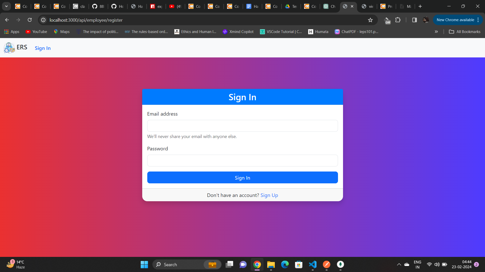
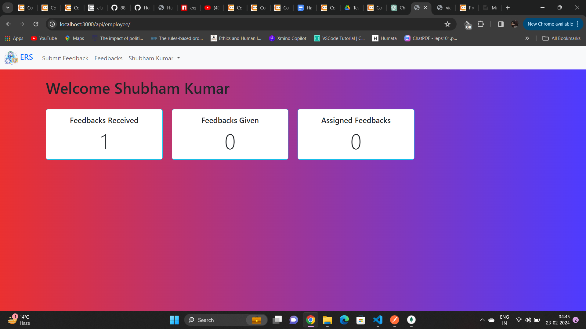
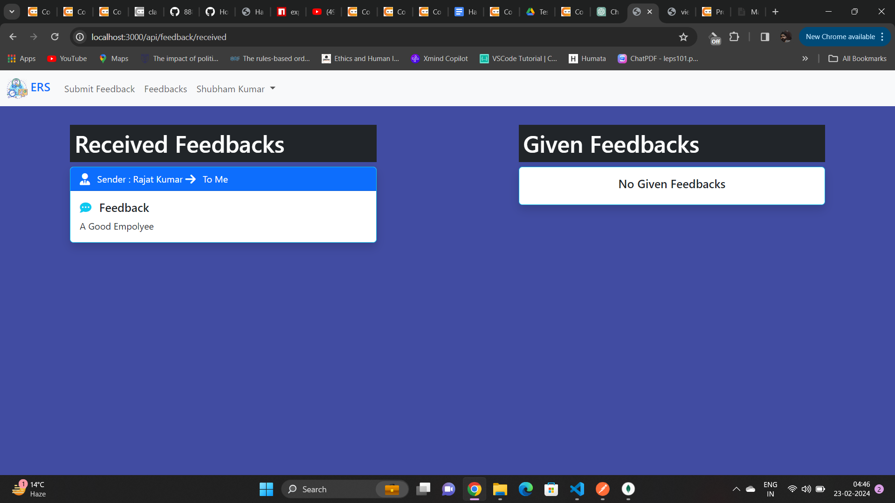
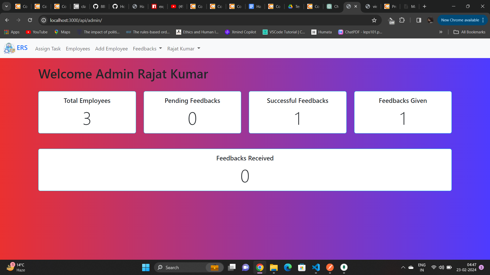
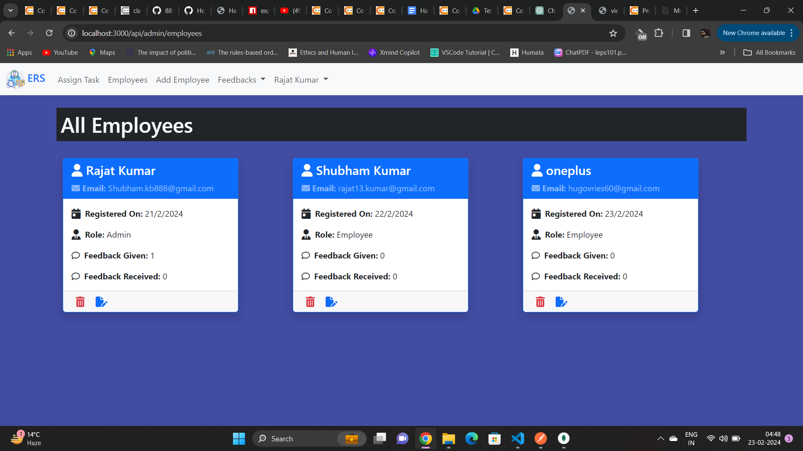
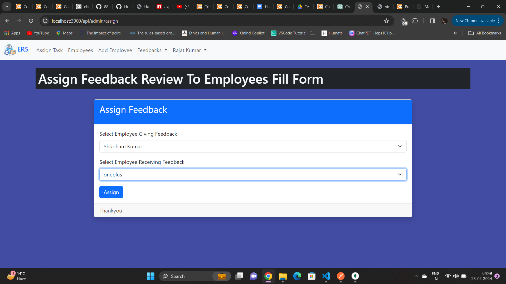
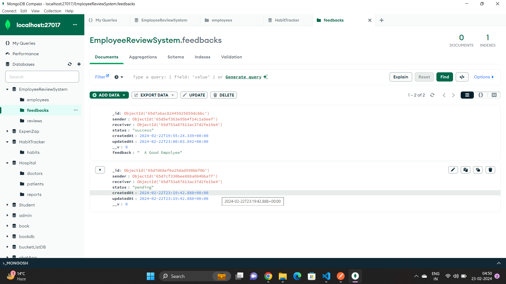
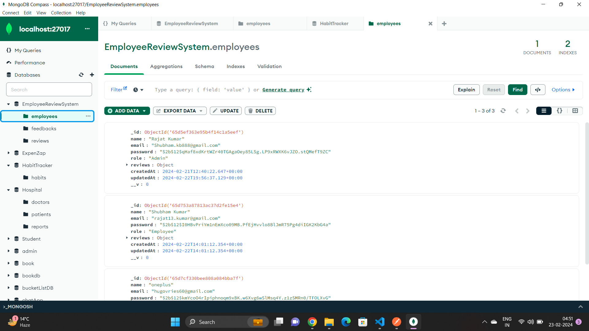
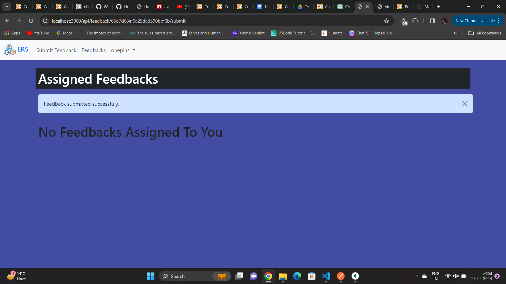

# Employee Review System

This is a full-stack Employee Review System web application built with Node.js, Express.js, MongoDB, and EJS. It allows employees to submit feedback toward each other’s performance.

## Description

The Employee Review System facilitates the feedback process among employees in an organization. It enables employees to provide feedback on their peers' performance, which can be constructive criticism or praise. The system is designed to improve communication and collaboration within the workplace.

## Features

### Admin View
- Add/remove/update/view employees
- Add/update/view performance reviews
- Assign employees to participate in another employee's performance review

### Employee View
- List of performance reviews requiring feedback
- Submit feedback

## Technologies Used

- Node.js
- Express.js
- MongoDB
- EJS (Embedded JavaScript)
- Express Session
- Express EJS Layouts
- Body Parser
- Cookie Parser
- dotenv

## Installation

1. Clone the repository:

   ```bash
   git clone https://github.com/888Shubham/Employee_Review_System.git
   cd Employee_Review_System
   
2. Install dependencies:

    ```bash
    cd Hospital_API
    npm install
    ```

3. Set up environment variables:

    Create a `.env` file in the root directory and add the following variables:

    ```plaintext
    PORT (Port number for the server)
    MONGODB_URI (MongoDB connection URI)
    ```

4. Start the server:

    ```bash
    npm start
    ```
# API Routes
-Open your web browser and navigate to http://localhost:3000 to access the Employee Review System.

## Employee Routes

### Get Homepage
- **URL:** `/api/employee/`
- **Method:** `GET`
- **Description:** Displays the employee homepage.

### Register
- **URL:** `/api/employee/register`
- **Method:** `GET`
- **Description:** Displays the employee registration form.

### Sign Up
- **URL:** `/api/employee/signup`
- **Method:** `POST`
- **Description:** Registers a new employee.

### Sign In
- **URL:** `/api/employee/signin`
- **Method:** `POST`
- **Description:** Signs in an employee.

### Log Out
- **URL:** `/api/employee/logout`
- **Method:** `GET`
- **Description:** Logs out an employee.

### Delete Employee
- **URL:** `/api/employee/:employeeId/delete`
- **Method:** `GET`
- **Description:** Deletes an employee.

### Update Employee
- **URL:** `/api/employee/:employeeId/update`
- **Method:** `POST`
- **Description:** Updates employee details.

## Feedback Routes

### Get Assigned Feedback
- **URL:** `/api/feedback/assigned`
- **Method:** `GET`
- **Description:** Retrieves feedback assigned to the employee.

### Submit Feedback
- **URL:** `/api/feedback/:feedbackId/submit`
- **Method:** `POST`
- **Description:** Submits feedback for a performance review.

### Get Received Feedback
- **URL:** `/api/feedback/received`
- **Method:** `GET`
- **Description:** Retrieves feedback received by the employee.

### Get All Employees' Feedback
- **URL:** `/api/feedback/employees-feedback`
- **Method:** `GET`
- **Description:** Retrieves all employees' feedback.

### Update Feedback
- **URL:** `/api/feedback/:feedbackId/update`
- **Method:** `POST`
- **Description:** Updates feedback details.

## Admin Routes

### Get Admin Homepage
- **URL:** `/api/admin/`
- **Method:** `GET`
- **Description:** Displays the admin homepage.

### Assign Feedback
- **URL:** `/api/admin/assign`
- **Method:** `GET`
- **Description:** Displays the assign feedback page.

### Post Assign Feedback
- **URL:** `/api/admin/assign`
- **Method:** `POST`
- **Description:** Assigns feedback to employees.

### Add New Employee
- **URL:** `/api/admin/add-employee`
- **Method:** `POST`
- **Description:** Adds a new employee.

### Get All Employees
- **URL:** `/api/admin/employees`
- **Method:** `GET`
- **Description:** Retrieves all employees.

## Contributing

Contributions are welcome! Please create a new branch for your changes and submit a pull request for review.

## Hosted URL
You can access the deployed application [here](https://employee-review-system-l1sk.onrender.com).


## Screenshots










